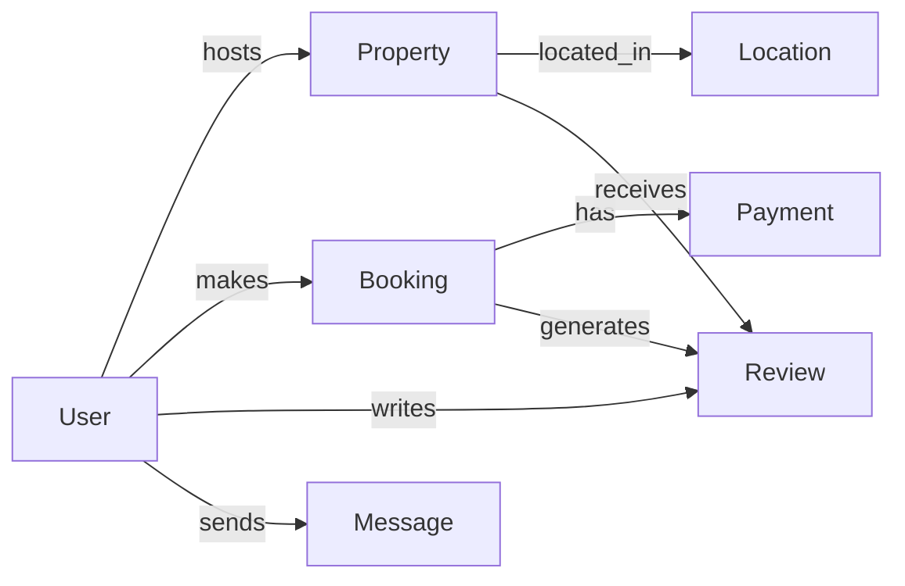

# Vacation Rental Platform - Sample Data Population

This repository contains sample data for a vacation rental platform database. The dataset provides realistic information to test and demonstrate the platform's functionality, including user interactions, property listings, bookings, payments, reviews, and messaging

## Dataset Features

- **Realistic Scenarios**: Simulates actual user behavior and transactions
- **Diverse Locations**: Properties in 5 international destinations
- **Multiple User Roles**: Hosts, guests, and admin accounts
- **Complete Workflows**: Booking → Payment → Stay → Review cycles
- **Relationship Mapping**: Demonstrates all entity relationships in schema

## Getting Started

### Prerequisites

- PostgreSQL 12+ (with `uuid-ossp` extension enabled)
- Database schema created using [schema.sql](schema.sql)

### Installation

1. Create database and enable extension:

   ```sql
   CREATE DATABASE vacation_rental;
   \c vacation_rental
   CREATE EXTENSION IF NOT EXISTS "uuid-ossp";
   ```

2. Run population script:
   ```bash
   psql -d vacation_rental -f sample_data.sql
   ```

### Verification

Check successful data insertion:

```sql
-- Count records per table
SELECT 'User' AS table, COUNT(*) FROM "User"
UNION ALL SELECT 'Location', COUNT(*) FROM Location
UNION ALL SELECT 'Property', COUNT(*) FROM Property
UNION ALL SELECT 'Booking', COUNT(*) FROM Booking
UNION ALL SELECT 'Payment', COUNT(*) FROM Payment
UNION ALL SELECT 'Review', COUNT(*) FROM Review
UNION ALL SELECT 'Message', COUNT(*) FROM Message;
```

## Sample Queries

### 1. Active Bookings in Paris

```sql
SELECT u.first_name, u.last_name, p.name, b.start_date, b.end_date
FROM Booking b
JOIN "User" u ON b.user_id = u.user_id
JOIN Property p ON b.property_id = p.property_id
JOIN Location l ON p.location_id = l.location_id
WHERE l.city = 'Paris'
AND CURRENT_DATE BETWEEN b.start_date AND b.end_date;
```

### 2. Host Revenue Report

```sql
SELECT
  u.first_name || ' ' || u.last_name AS host,
  SUM(py.amount) AS total_revenue,
  COUNT(DISTINCT p.property_id) AS properties,
  COUNT(b.booking_id) AS bookings
FROM Payment py
JOIN Booking b ON py.booking_id = b.booking_id
JOIN Property p ON b.property_id = p.property_id
JOIN "User" u ON p.host_id = u.user_id
GROUP BY host;
```

### 3. Guest Communication History

```sql
SELECT
  s.first_name || ' ' || s.last_name AS sender,
  r.first_name || ' ' || r.last_name AS recipient,
  m.message_body,
  m.sent_at
FROM Message m
JOIN "User" s ON m.sender_id = s.user_id
JOIN "User" r ON m.recipient_id = r.user_id
WHERE s.email = 'emma@example.com' OR r.email = 'emma@example.com'
ORDER BY m.sent_at DESC;
```

## Data Relationships



## Key Business Rules Demonstrated

1. **Booking Validation**: End date after start date
2. **Review Restrictions**: Only confirmed bookings can have reviews
3. **Payment Connection**: Payments only for existing bookings
4. **User Roles**: Hosts create properties, guests make bookings
5. **Message Restrictions**: Users can't message themselves

## Customization

To modify the sample data:

1. Adjust date ranges in bookings
2. Change price points in properties
3. Add more locations
4. Extend user profiles
5. Modify booking statuses

Example modification (add new property):

```sql
INSERT INTO Property (property_id, host_id, name, description, location_id, pricepernight)
SELECT
  uuid_generate_v4(),
  user_id,
  'Mountain Cabin Retreat',
  'Secluded cabin with mountain views',
  (SELECT location_id FROM Location WHERE city = 'Kyoto'),
  175.00
FROM "User"
WHERE email = 'sarah@example.com';
```
